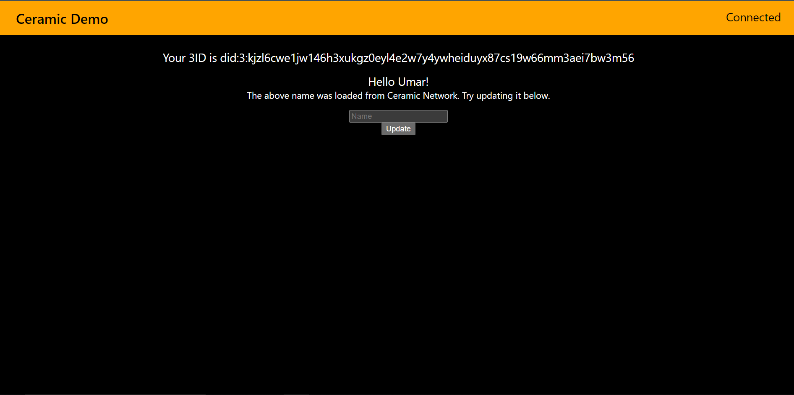

### Decentralized Identity

This is a small app that illustrates how to make and update your decentralized ID
using Ceramic .

It will be really useful in future .

### Usage Guide

    - Visit website With Metamask installed 
    - Make sure you have some test Goerli Eth 
    - Switch to Goerli Testnet
    - Connect your Metamask
    - See Existing Identity Information
    - Change your name
    - Check your updated name on Decentralized Identity
    - Currently it just supports name , but we can do much more like social media handles, awatar etc.

### Deployment Link
https://decentralized-identity.vercel.app/
